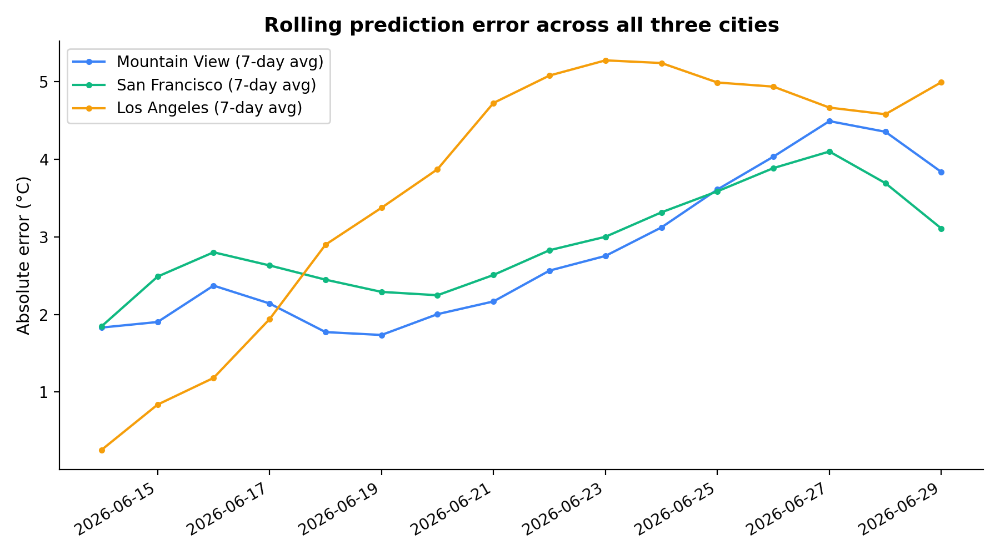
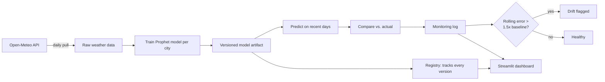
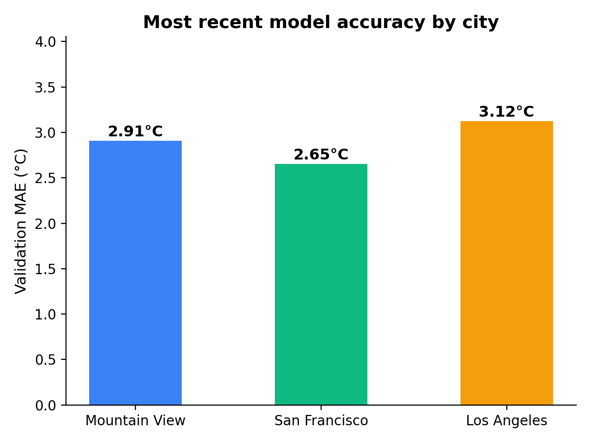
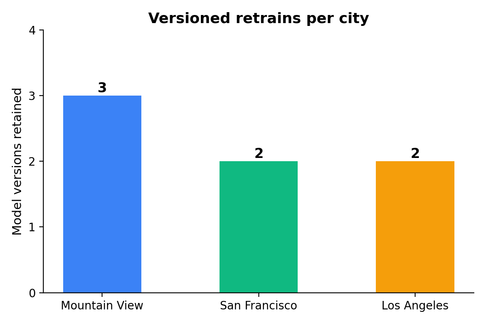

# Weather Forecast MLOps Pipeline

An automated daily temperature forecasting system for three California cities, with scheduled retraining, model versioning, and drift monitoring -- built to demonstrate the operational lifecycle of a machine learning system, not just the model itself.

**Live app:** [https://weather-forecast-mlops-hcurhoayeg2xyvrddm6xli.streamlit.app/](https://weather-forecast-mlops-hcurhoayeg2xyvrddm6xli.streamlit.app/)



## Goal

Most portfolio ML projects stop at "train a model, deploy it once." This project asks a different question: **what does it take for a model to keep working correctly, unattended, over time?** The forecasting target -- daily max temperature for Mountain View, San Francisco, and Los Angeles -- is intentionally simple. The actual subject of the project is the system around the model: automated retraining, versioning, and self-monitoring.

## Why this project

After building two classification projects (NBA shot prediction, MLB breakout prediction), I wanted to demonstrate a different and complementary skill: **ML operations**, not just ML modeling. Specifically:

1. A model that retrains itself on a schedule, with no manual intervention
2. Every retrain versioned and retained, never silently overwritten
3. A monitoring system that checks the model's real-world accuracy daily and flags when it degrades
4. Resilience to the kind of transient failures (network timeouts, API hiccups) that any system calling external services in production will eventually hit

## Architecture



The entire pipeline -- pull, retrain, evaluate, commit -- runs daily via a scheduled GitHub Actions workflow. No step requires a human to trigger it.

## Data

- **Source:** Open-Meteo Historical Weather API (ERA5 reanalysis), free, no API key required
- **Cities:** Mountain View, San Francisco, Los Angeles -- chosen for genuinely different microclimates (Peninsula, coastal/marine layer, and inland/coastal mix respectively)
- **Window:** Rolling 5 years of daily max temperature, refreshed on every retrain
- **Reliability:** ERA5 reanalysis data is gap-free by construction -- zero missing values across all three cities in this project

## Modeling approach

Each city gets its own [Prophet](https://facebook.github.io/prophet/) model with yearly seasonality enabled (weekly and daily seasonality disabled, since neither is meaningful for daily max temperature). The model is deliberately simple -- the project's value is in what surrounds it, not in forecasting sophistication.



All three cities land in a similar 2.6-3.1°C validation MAE range, which is a reasonable error margin for daily temperature forecasting -- weather has genuine day-to-day variability that no seasonal model can fully capture.

## The automation pipeline

A GitHub Actions workflow runs daily and performs four steps in sequence:

1. **Pull fresh data** from Open-Meteo for all three cities
2. **Retrain each city's model** on the updated rolling window, saving a new timestamped version (prior versions are never deleted)
3. **Evaluate drift** by predicting on the most recent ~2 weeks and comparing against freshly observed actuals, appending the result to a per-city monitoring log
4. **Commit** the updated data, models, and logs back to the repository -- the commit history itself becomes an audit trail of every automated run



## A real debugging story: Prophet/cmdstanpy version conflict

Prophet's forecasting backend depends on `cmdstanpy`, which wraps a separately compiled Stan toolchain. Installing `prophet==1.1.6` with an unpinned `cmdstanpy` dependency pulled the latest cmdstanpy release, whose internal backend constructor signature had changed since Prophet 1.1.6 was built. The result was a misleading `AttributeError: 'Prophet' object has no attribute 'stan_backend'` that gave no indication of the real cause.

Bypassing Prophet's exception handling to call the backend constructor directly surfaced the actual error: `TypeError: __init__() got an unexpected keyword argument 'model'` -- a genuine version mismatch, not a configuration or installation problem. Pinning `cmdstanpy==1.2.0` alongside `prophet==1.1.6` resolved it. This is now an explicit pin in `requirements.txt` rather than a loose dependency, so the same conflict can't silently reappear.

## A real production failure: transient network timeout

The first scheduled GitHub Actions run failed on a `ReadTimeoutError` calling Open-Meteo -- a TLS handshake that didn't complete within the original 30-second timeout. This is a normal, expected category of failure for any system making live network calls from shared CI infrastructure; it reflects nothing wrong with the API or the code. The fix was to add retry-with-exponential-backoff to every external API call, rather than letting a single transient hiccup fail the entire scheduled job. Subsequent runs have been stable.

## A real model limitation, found in production

On 2026-06-27, the Mountain View model predicted 28.0°C (typical for late June) but the actual observed max was 21.2°C -- a 6.8°C miss, the largest recorded so far. This is the expected signature of a short-term synoptic weather event (likely a marine-layer intrusion) that a model built only on yearly seasonality cannot anticipate. The monitoring dashboard surfaced this clearly as a single-day spike in the error chart, while the 7-day rolling average -- the actual drift-detection signal -- stayed under the alert threshold, correctly distinguishing a one-off anomaly from a sustained degradation in model quality.

## Drift detection logic

A city's model is flagged for drift when its rolling recent-day mean absolute error exceeds 1.5x its original training validation MAE. This threshold is deliberately conservative: it tolerates normal day-to-day weather noise (like the June 27th event above) while still catching genuine, sustained accuracy degradation that would warrant investigation or a structural model change.

## How to run it

```bash
git clone https://github.com/rohanc27/weather-forecast-mlops.git
cd weather-forecast-mlops
python3 -m venv .venv
source .venv/bin/activate
pip install -r requirements.txt

# Pull data for all three cities
python -m src.data.pull_weather

# Train models
python -m src.models.train_forecast --city all

# Evaluate drift / update monitoring logs
python -m src.monitoring.evaluate_drift

# Launch the dashboard
streamlit run app/streamlit_app.py
```

To run the full pipeline automatically, the included GitHub Actions workflow (`.github/workflows/retrain.yml`) handles scheduling -- no manual steps required once deployed.

## Project structure

```
weather-forecast-mlops/
├── .github/workflows/
│   └── retrain.yml              # Daily scheduled pipeline
├── src/
│   ├── data/
│   │   └── pull_weather.py      # Open-Meteo data pull, with retry
│   ├── models/
│   │   └── train_forecast.py    # Per-city Prophet training + versioning
│   └── monitoring/
│       └── evaluate_drift.py    # Prediction-vs-actual drift checks
├── models/
│   ├── registry.json            # Every model version, ever trained
│   └── <city>/v_<timestamp>/    # Versioned model artifacts
├── monitoring/
│   └── <city>_predictions.csv   # Rolling prediction-accuracy log
├── app/
│   └── streamlit_app.py         # MLOps dashboard
└── scripts/
    └── make_readme_figures.py
```

## Limitations

- The model captures climatological seasonality, not short-term synoptic weather events (see the June 27th example above)
- Only daily max temperature is forecast; no precipitation, wind, or minimum temperature
- Drift threshold (1.5x baseline) is a reasonable starting heuristic, not statistically optimized
- Three cities is a deliberately small scope to keep the automation pipeline clean and debuggable, not a constraint of the underlying approach

## References

- Taylor, S.J., Letham, B. (2018). Forecasting at scale. *The American Statistician*, 72(1):37-45.
- Open-Meteo Historical Weather API -- ERA5 reanalysis, ECMWF.